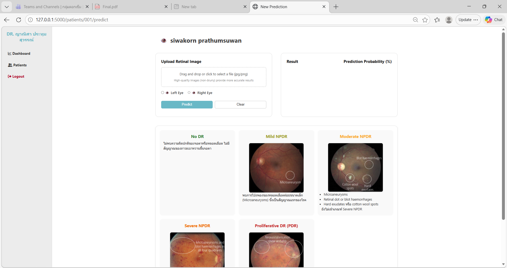
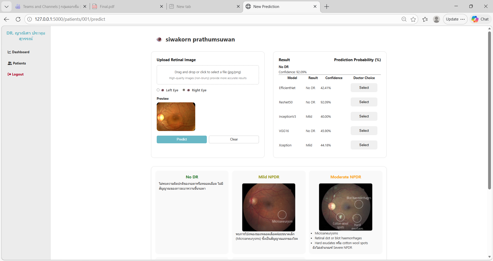
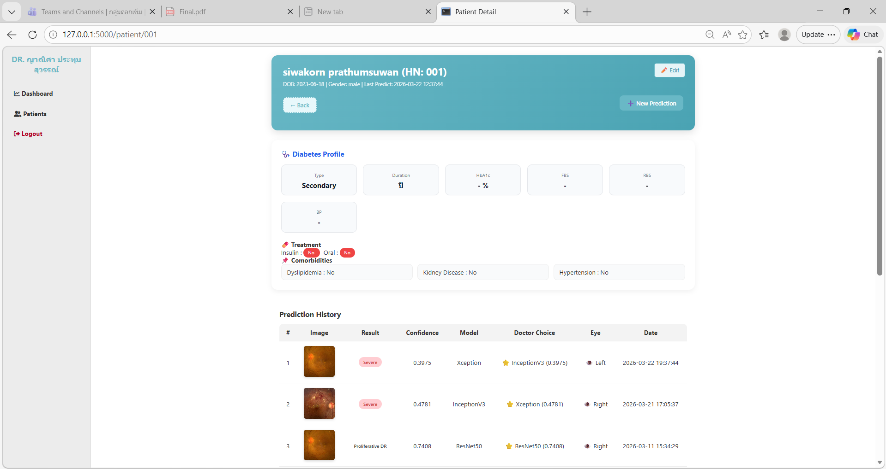

# 👁️ Diabetic Retinopathy Severity Classification System

A web-based application for classifying the severity of **Diabetic Retinopathy (DR)** into 5 levels using deep learning models.

- ResNet50  
- Xception  
- InceptionV3  
- VGG16  
- EfficientNetB0  

---

